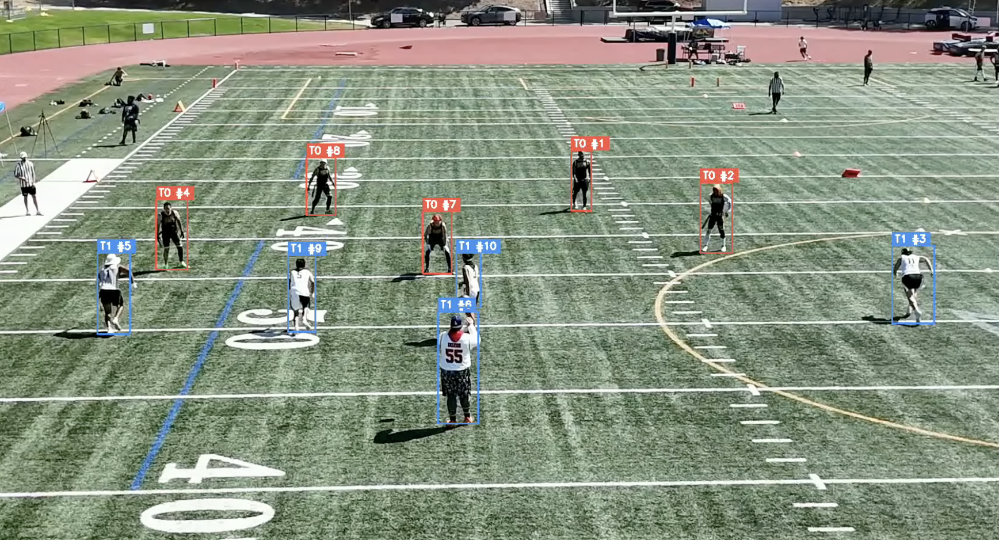
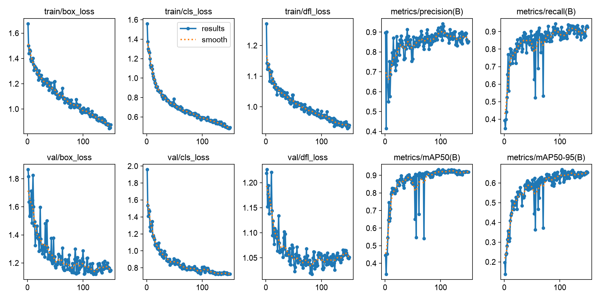
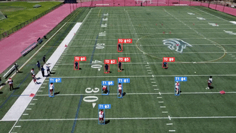

<div align="center">

# XFlagCV
### Flag Football Player Detection, Tracking &amp; Team Identification

*A computer vision pipeline for tracking players and assigning teams from drone footage*

***Andrew Nguyen***

<br />

[](https://www.python.org/)
[](#)
[](#)
[](https://opensource.org/licenses/MIT)

<br />

[Overview](#overview) | [Architecture](#architecture) | [Methodology](#methodology) | [Evaluation](#evaluation) | [Results](#results) | [Limitations](#limitations) | [Installation](#installation) | [Usage](#usage) | [Future Work](#future-work) | [References](#references)

</div>

---

## Overview

<div align="center">
  
</div>

**XFlagCV** is a computer vision framework for detecting, tracking, and identifying players from drone footage of flag football games. Built on a custom trained YOLO11 detector, BoT-SORT tracking, and SigLIP based team classification, the pipeline turns raw aerial video into player tracked and team labeled footage — without relying on wearable sensors,  jersey numbers, or manual annotation.

Flag football presents a uniquely difficult case for player tracking. 
Unlike broadcast american football with stabilized camera work, and unified jerseys/numbers, flag football involves drone footage that can be wide, distant, and unstabilized.

Flag football also naturally packs 10+ players into a tight cluster with teammates wearing identical jerseys leaving no individual visual cues most tracking systems rely on.

### What It Does

- 🎯 **Detects players** 
- 🔗 **Tracks players frame-to-frame** 
- 🎽 **Assigns teams automatically** 
- 🎥 **Outputs labeled video** 

### What Makes It Hard

- 🤼 **Dense payer contact** 
- 🚁 **Random drone orientation**

---

## Architecture

<p align="center">
  
  <em>Pipeline Flowchart</em>
</p>

XFlagCV is built as a pipeline where each stage's output feeds into the next. 
1. Detection and tracking run continuously across every frame; 
2. Team assignment runs once, using a pre-snap frame; 
3. stitching runs once at the end, cleaning up broken id's across the whole clip.

| Stage | Component | Input | Output |
|---|---|---|---|
| 1 | **Detection** — custom YOLO11 model | Raw video frame | Player bounding boxes |
| 2 | **Tracking** — BoT-SORT | Boxes across frames | Persistent track IDs |
| 3 | **Team Assignment** — SigLIP + UMAP + KMeans | One pre-snap frame's player crops | `{track_id: team}` lookup, locked |
| 4 | **Track Stitching** — position/time/team matching | Full clip's track history | Cleaned, reunited track IDs |

**Output:** labeled video with every player boxed, tracked, and team colored across the full play.

---

## Project Structure


```text
XFlagCV/
├── 📁 weights/
│   └── best.pt                 # trained YOLO11 detection model
├── 📁 src/
│   ├── team_assigner.py        # pre-snap SigLIP-based team classification
│   ├── track_stitcher.py       # post tracking identity recovery
│   └── pipeline.py             # pipeline entry point
├── 📁 assets/
│   └── (photos/gifs etc)
└── 📄 README.md
```

---

## Methodology

### Detection
*Located in `weights/best.pt`:*

Player detection uses a custom-trained YOLO11 model rather than a generic pretrained detector. The model was fine-tuned  across multiple rounds of hand annotaded game footage involving a variety of drone heights, angles and orientations. 

### Tracking
*Located in `src/pipeline.py`:*

Frame-to-frame player tracking uses **BoT-SORT**. 
This choice comes from published research [Otsubo et al. (2025)](#references) where they benchmarked seven trackers and found BoT-SORT achieved the best scores both before and after fine tuning.

### Team Assignment
*Located in `src/team_assigner.py`:*

`TeamAssigner` fits once, on a single clean pre snap frame, and locks each track's team permanently. 
Team color is extracted using **SigLIP embeddings, reduced with UMAP, and clustered with KMeans** (via `roboflow/sports`) instead of raw pixel color averaging.

### Track Stitching
*Located in `src/track_stitcher.py`:*

like all current trackers, BoT-SORT does not  preserve player identity through heavy contact, a tracked player can lose their ID mid-collision and be reassigned a new one on reappearance. `TrackStitcher` is a custom post processing layer designed to detects these breaks and merges them back together.

---

## Evaluation

<p align="center">
  <br>
  <em>Pre-Snap Player detection and team assignment</em>
</p>

### Performance Metrics (Player Detection)

Trained on hand annotaded drone footage (Roboflow), final model: `weights/best.pt`

| Metric | Score |
|---|---|
| mAP@50 | 93.2% |
| mAP@50-95 | 65% |
| Precision | 94.2% |
| Recall | 85.9% |
| F1 | 89.8% |

<p align="center">
  <br>
  <em>Training Curves</em>
</p>

### Performance Metrics (Team Assignment)

To be be tested


---

## Results

### Full Pipeline

<div align="center">
  
</div>

The clip above shows the complete pipeline running. 
Detection, tracking, pre-snap team locking, and stitching, all overlaid live on unedited drone footage. Each box is colored by team, labeled with a persistent player ID.

### How to Read the Output

- **Solid team-colored box (red/blue)** — a player with a confidently resolved, locked team identity
- **Yellow box** — an unresolved track, likely an identity the stitching layer could not confidently reunite after a break


### What Works Well

- Pre-snap team assignment is reliable and once locked, holds for the remainder of the play for any track that isn't interrupted
- Player identity survives ordinary movement, running, and moderate crowding without issue

### Where It Still Struggles

- **Contact and collisions** When multiple players collide and separate over several frames, the tracker can fragment a single player's identity into more IDs
- **Poor film conditions** Team assignment struggles when jerseys are similar, lighting is bright or dark, and when drone angles are too steep or shallow.


---

## Limitations


- **Identity switches under heavy contact.** this is a known issue and is actively being researched ([Otsubo et al., 2025](#references)).

- **Same-team jersey ambiguity in edge cases.** Team assignment relies on visual from a single pre-snap frame; Similar or identical dark uniforms often produce a misclassification.


- **No ball tracking.** The pipeline tracks and identifies players only. For XFlag, ball detection would be too difficult, the variability in drone football, combined with the small ball size, frequent occlusion, and motion blur make it a substantially harder to detect than players.

- **No field-coordinate mapping.** Player positions are in pixel space, not real-world field coordinates. Distance, speed, and formation based stats are not yet possible without a future homography transform.

- **Drone film variablity** Games are recorded with manned drone crews creating film variablity in height, angle, and movement.

---

## Installation

**Requirements:** 

- Python 3.9+
- ultralytics
- opencv-python
- numpy
- scikit-learn
- torch

```bash
# Clone repo
git clone https://github.com/<your-username>/XFlagCV.git
cd XFlagCV

# Create and start virtual environment
python -m venv cv
source cv/bin/activate      # Windows: cv\Scripts\activate

# Install dependencies
pip install ultralytics ... etc

# Don't forget the SigLIP-based team classifier
pip install git+https://github.com/roboflow/sports.git
```

**Model weights:** the trained player detector (`best.pt`) is  in `weights/`. 
If it doesn't pull automatically,

```bash
git lfs install
git lfs pull
```

---

## Usage

<!-- runnable code snippet -->

---

## Future Work

<!-- planned features, cited prior art -->

---

## References

---

</div>
