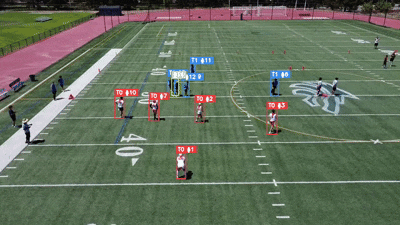
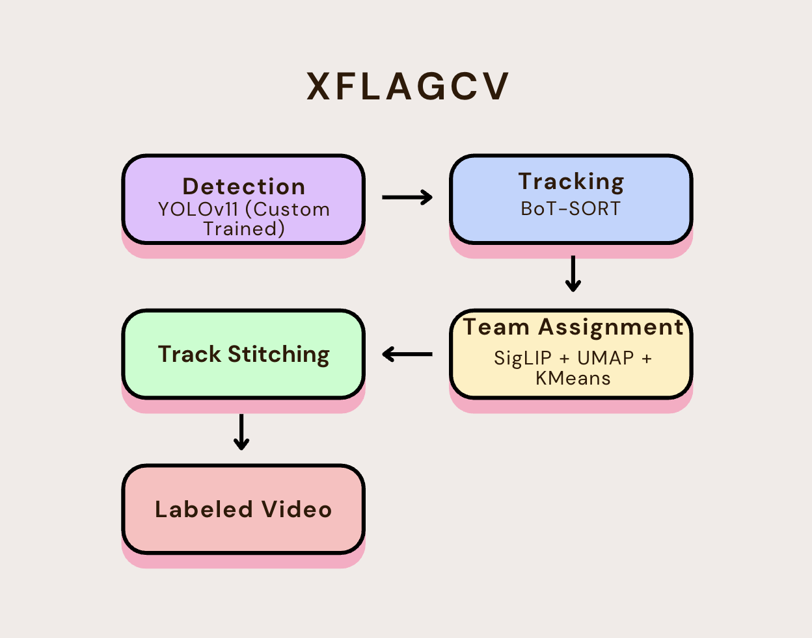

<div align="center">

# XFlagCV
### Flag Football Player Detection, Tracking &amp; Team Identification

*A computer vision pipeline for tracking players and assigning teams from drone footage*

***Andrew Nguyen***

<br />

[](https://www.python.org/)
[](#)
[](#)
[](https://opensource.org/licenses/MIT)

<br />

[Overview](#overview) | [Architecture](#architecture) | [Methodology](#methodology) | [Evaluation](#evaluation) | [Results](#results) | [Limitations](#limitations) | [Installation](#installation) | [Usage](#usage) | [Future Work](#future-work)

</div>

---

## Overview

<div align="center">
  
</div>

**XFlagCV** is a computer vision framework for detecting, tracking, and identifying players from drone footage of flag football games. Built on a custom trained YOLO11 detector, BoT-SORT tracking, and SigLIP based team classification, the pipeline turns raw aerial video into player tracked and team labeled footage — without relying on wearable sensors,  jersey numbers, or manual annotation.

Flag football presents a uniquely difficult case for player tracking. 
Unlike broadcast american football with stabilized camera work, and unified jerseys/numbers, flag football involves drone footage that can be wide, distant, and unstabilized.

Flag football also naturally packs 10+ players into a tight cluster with teammates wearing identical jerseys leaving no individual visual cues most tracking systems rely on.

### What It Does

- 🎯 **Detects players** 
- 🔗 **Tracks players frame-to-frame** 
- 🎽 **Assigns teams automatically** 
- 🎥 **Outputs labeled video** 

### What Makes It Hard

- 🤼 **Dense payer contact** 
- 🚁 **Random drone orientation**

---

## Architecture

<p align="center">
  
</p>

XFlagCV is built as a pipeline where each stage's output feeds into the next. 
1. Detection and tracking run continuously across every frame; 
2. Team assignment runs once, using a pre-snap frame; 
3. stitching runs once at the end, cleaning up broken id's across the whole clip.

| Stage | Component | Input | Output |
|---|---|---|---|
| 1 | **Detection** — custom YOLO11 model | Raw video frame | Player bounding boxes |
| 2 | **Tracking** — BoT-SORT | Boxes across frames | Persistent track IDs |
| 3 | **Team Assignment** — SigLIP + UMAP + KMeans | One pre-snap frame's player crops | `{track_id: team}` lookup, locked |
| 4 | **Track Stitching** — position/time/team matching | Full clip's track history | Cleaned, reunited track IDs |

**Output:** labeled video with every player boxed, tracked, and team colored across the full play.

---

## Project Structure


```text
XFlagCV/
├── 📁 weights/
│   └── best.pt                 # trained YOLO11 detection model
├── 📁 src/
│   ├── team_assigner.py        # pre-snap SigLIP-based team classification
│   ├── track_stitcher.py       # post tracking identity recovery
│   └── pipeline.py             # pipeline entry point
├── 📁 assets/
│   └── (photos/gifs etc)
└── 📄 README.md
```

---

## Methodology

<!-- detection / tracking / team assignment / stitching — the "how and why" -->

---

## Evaluation

<!-- training curves, precision/recall/mAP numbers, presnap accuracy -->

---

## Results

<!-- demo gif #2 or stills showing the full pipeline in action -->

---

## Limitations

<!-- known failure modes, honestly framed, with citations -->

---

## Installation

<!-- venv setup, requirements.txt, weight download -->

---

## Usage

<!-- runnable code snippet -->

---

## Future Work

<!-- planned features, cited prior art -->

---


</div>
